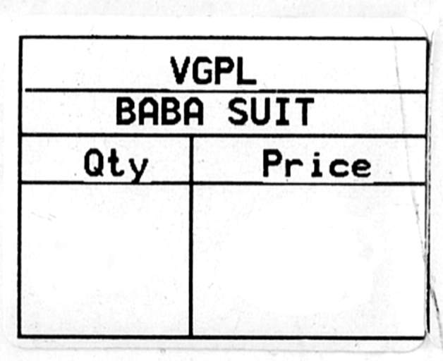

# 🦄 Sugar-SynthYOLO 🦄

## Overview

Welcome to **Sugar-SynthYOLO**! 🎉 The sweetest tool for generating Sugar-Synthetic datasets for YOLO-style object detection models. This script lets you create thousands of labeled images with randomized numbers, fonts, and placements—perfect for training robust models for receipts, tickets, or any scenario where numbers matter! 🚀

## Why This Tool

Tired of manually creating labeled images for your computer vision projects? Want to quickly generate diverse, realistic samples for training? **Sugar-SynthYOLO** automates the process—just provide a clean template image and a folder of fonts, and let the script do the rest!

### Example Input

|  |  |
|:---:|:---:|

### After Using Tool

|  |  |
|:---:|:---:|

## Features

- **Sugar-Synthetic Dataset Generation**: Create thousands of labeled images for YOLO training. 🖼️➡️📄
- **Randomized Numbers & Fonts**: Each sample uses random numbers and fonts for maximum diversity. 🔢🎨
- **Rotated Text**: Numbers are randomly rotated for realistic augmentation. 🔄
- **YOLO Label Output**: Generates `.txt` files with YOLO-format bounding boxes and appended ground-truth numbers. 📝
- **Debug Images**: Optionally outputs debug images with bounding boxes for easy inspection. 🐞

## Requirements

To get started, ensure you have the following:

- Python 3.x 🐍
- [Pillow](https://pypi.org/project/Pillow/) library 📦

## Installation

1. **Clone the Repository**:
   ```bash
   git clone https://github.com/Sugarcube08/Sugar-SynthYOLO.git
   cd Sugar-SynthYOLO
   ```

2. **Install Required Libraries**:
   ```bash
   pip install pillow
   ```

3. **Prepare Your Assets**:
   - Place your clean template image as `input.png` in the root folder.
   - Add your font files (`.ttf`, `.otf`, `.ttc`) to the `fonts/` directory.

## Usage

To generate your Sugar-Synthetic dataset, simply run:
```bash
python run.py
```
- The script will create images in `dataset/images/`, YOLO labels in `dataset/labels/`, and debug images in `dataset/debug/`.

## Example

1. **Input**: `input.png` (your template), fonts in `fonts/`
2. **Output**: 
   - `dataset/images/sample_0.png` (Sugar-Synthetic image)
   - `dataset/labels/sample_0.txt` (YOLO label + ground-truth numbers)
   - `dataset/debug/sample_0.png` (debug image with bounding boxes)

## License

This project is licensed under the MIT License. See the LICENSE file for more details. 📜

## Acknowledgments

A big thank you to:
- [Pillow](https://github.com/python-pillow/Pillow) for image processing. 🖼️
- All font creators for their amazing typefaces. ✨

## Join the Sweet Revolution! 🍭

Automate your dataset creation with **Sugar-SynthYOLO**! If you have any questions, suggestions, or want to share your results, feel free to reach out. Happy training! 🎉🥳

---
          
## Made with ❤️ by SugarCube               
---
## ☕ Support Me
If you like this project, consider buying me
 a coffee!
[](https://www.buymeacoffee.com/sugarcube08)   

---
## Don't Forget To Subscribe
### Click on the Following Buttons:
[](https://www.youtube.com/@SugarCode-Z?sub_confirmation=1)
[](https://www.instagram.com/sugarcodez)
[](https://whatsapp.com/channel/0029Vb5fFdzKgsNlaxFmhg1T)